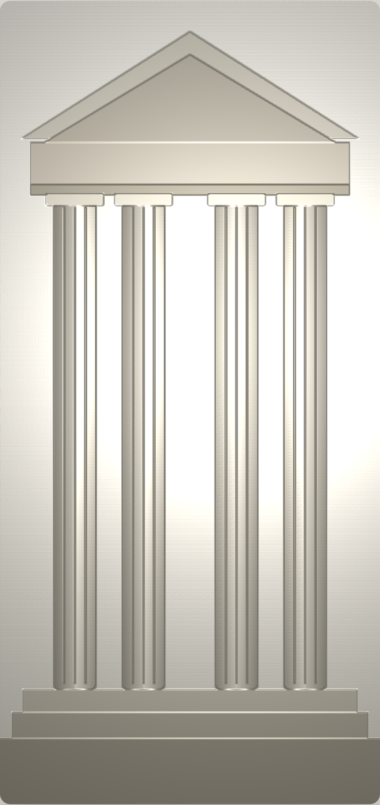

# Metallic Facade

An interactive **matte → metallic hover effect** for images, reproduced from
[week.wild.plus/athens-26](https://week.wild.plus/athens-26).

Move your cursor over an image and a light follows it, lighting up the surface
with chrome-like specular highlights. A **normal map** gives the flat image fake
3D relief, so columns, statues, and facades appear to catch the light.

**[▶ Live demo](https://ibackstrom.github.io/metallic-facade/)**



- Zero dependencies, ~9 KB of vanilla JavaScript
- Raw WebGL2 (with a WebGL1 fallback)
- Auto-generates a normal map from your image if you don't supply one
- The fragment shader is adapted directly from the original site

> Want to know *how* it works? See **[HOW-IT-WORKS.md](HOW-IT-WORKS.md)** for a
> line-by-line walkthrough of the shader and the math behind it.

---

## Quick start

1. Copy [`metallic-facade.js`](metallic-facade.js) into your project.
2. Add a container element with a fixed size:

   ```html
   <div id="stage" style="width: 520px; aspect-ratio: 498/1050;"></div>
   ```

3. Initialise the effect:

   ```html
   <script type="module">
     import MetallicFacade from './metallic-facade.js';

     new MetallicFacade(document.getElementById('stage'), {
       image: 'facade.jpg',
     });
   </script>
   ```

That's it. A normal map is generated automatically from the image's brightness.
For the best look, supply a real normal map (see below).

---

## Options

All options are passed in the second argument. Defaults match the original site
unless noted.

| Option                   | Default     | What it does |
|--------------------------|-------------|--------------|
| `image`                  | `null`      | URL of the base image (required). |
| `normalMap`              | `null`      | URL of a normal map. If omitted, one is generated from the image. |
| `metallic`               | `0.85`      | `0` = matte shading, `1` = full chrome/metallic. |
| `lightIntensity`         | `0.4`       | Strength of the cursor light's diffuse term. |
| `ambientLight`           | `0.5`       | Base brightness everywhere (original site uses `0.06`). |
| `cursorAmbient`          | `0.19`      | Extra ambient added near the cursor. |
| `lightRadius`            | `1.5`       | How far the cursor light reaches (in aspect-corrected UV units). |
| `specular`               | `1.1`       | Strength of the matte specular highlight. |
| `cursorLightAngle`       | `135`       | Fixed light angle in degrees (used when not following the cursor). |
| `cursorDirFollowsCursor` | `1`         | `1` = light direction follows the cursor, `0` = fixed angle. |
| `lightColor`             | `[1,1,1]`   | RGB of the light (0–1 per channel). |
| `normalStrength`         | `1.0`       | Bump strength when auto-generating the normal map. Try `2`–`3`. |
| `fadeSpeed`              | `6`         | How fast the effect fades in/out on enter/leave. |

### Example: stronger chrome look

```js
new MetallicFacade(stage, {
  image: 'statue.jpg',
  normalMap: 'statue-normal.jpg',
  metallic: 1.0,
  ambientLight: 0.45,
  specular: 1.3,
  lightRadius: 1.2,
});
```

---

## Supplying a real normal map

The auto-generated map (from image brightness) is fine for a quick result, but a
real normal map looks far better. You can create one with:

- **Photoshop:** *Filter → 3D → Generate Normal Map*
- **[Materialize](https://boundingboxsoftware.com/materialize/)** (free)
- **[NormalMap Online](https://cpetry.github.io/NormalMap-Online/)** (browser)
- If you have a 3D model, bake the normal map from it.

Then pass it with `normalMap: 'your-normal.png'`.

---

## Running the demo locally

The page loads a JS module and an image, so it must be served over HTTP
(opening `index.html` directly via `file://` will be blocked by the browser):

```bash
# from the project folder
npx serve .
# or
python -m http.server 8000
```

Then open the printed URL.

---

## Files

| File | Purpose |
|------|---------|
| [`index.html`](index.html)             | Demo page. |
| [`metallic-facade.js`](metallic-facade.js) | The effect (the only file you need). |
| [`facade.svg`](facade.svg)             | Sample Greek-temple facade image. |
| [`HOW-IT-WORKS.md`](HOW-IT-WORKS.md)   | Detailed technical explanation. |

---

## Credit

The effect and its GLSL shader were reverse-engineered from the Framer site
[week.wild.plus/athens-26](https://week.wild.plus/athens-26) for educational
purposes.
